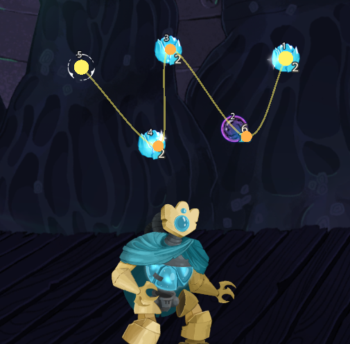
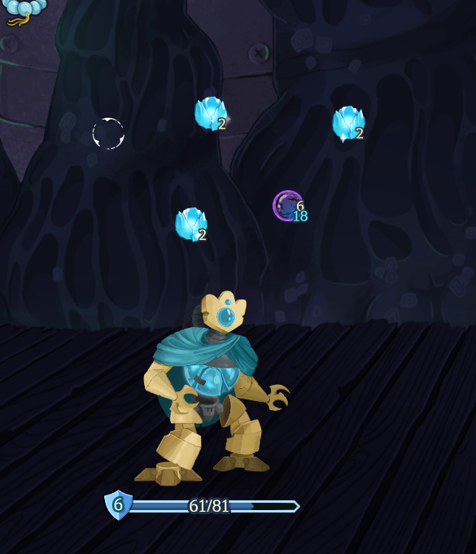

# StS2 Orb Layout

**Slay the Spire 2** 디펙터의 구체 슬롯 위치를 원하는 곡선 — 직선, 완만한 호, S자 — 어떤 모양으로든 자유롭게 재배치할 수 있는 모드입니다. 구체가 추가/소비되어 슬롯 수가 변해도 같은 곡선 위에 자동으로 다시 분포됩니다.

> 기본 부채꼴이 답답하셨다면, **Ctrl** 누르고 점을 끌어다 놓으세요. 그게 끝.

| 편집 모드 (Ctrl 누름) | 일반 플레이 결과 |
|---|---|
|  |  |

[English README](README.md)

**Nexus Mods:** https://www.nexusmods.com/slaythespire2/mods/808

---

## 기능

- 사용자가 배치한 waypoint 를 통과하는 **자유로운 Catmull-Rom 곡선** — 직선, 호, S자, 무엇이든
- **호 길이(arc-length) 균등 분포** — 슬롯 수와 무관하게 곡선 위에 골고루 배치
- **곡선 클릭만으로 waypoint 추가** — 곡선 위 원하는 지점을 클릭하면 그 자리에 control point 가 생김
- 슬롯 수가 늘거나 줄어도 **같은 곡선** 위에 자동으로 재분포
- 게임 재시작 후에도 **곡선이 그대로 유지** — 다음 전투에 바로 적용
- **로컬 디펙터 플레이어에만 적용** — 시각적 변경뿐, 게임 로직에는 손대지 않음
- 매니페스트에 `"affects_gameplay": false` 표기 — 멀티플레이 중에도 안전

## 조작

전투 중 디펙터(또는 구체 슬롯이 있는 캐릭터)로 플레이할 때 사용합니다.

| 입력 | 동작 |
|---|---|
| **`Ctrl` 누르고 있기** | 곡선 + waypoint 마커 + 슬롯 번호 표시 |
| **`Ctrl + 좌클릭` (waypoint 마커 위)** | waypoint 이동 |
| **`Ctrl + 좌클릭` (곡선 위, ≤18px)** | 그 자리에 새 waypoint 추가 + 즉시 드래그 시작 |
| **`Ctrl + Shift + 좌클릭`** (빈 공간) | 클릭 위치에 강제로 waypoint 추가 (파워 유저용) |
| **`Ctrl + 우클릭` (waypoint 마커 위)** | waypoint 제거 (양 끝점은 보호) |

전투 중 처음으로 `Ctrl` 을 누르는 시점에, 현재 구체 위치를 그대로 waypoint 로 캡처합니다 — 슬롯 하나당 control point 하나 — 즉시 끌어 옮길 수 있는 지점들이 생깁니다.

## 작동 방식

`MegaCrit.Sts2.Core.Nodes.Orbs.NOrbManager.TweenLayout()` 에 Harmony Prefix 패치를 적용합니다.

저장된 곡선이 있을 때:
1. 사용자의 waypoint 들을 Catmull-Rom 스플라인으로 연결
2. **호 길이 파라미터화**로 슬롯 *i*(전체 *N*) 를 곡선 길이의 `i/(N-1)` 지점에 배치
3. 원본 tween 은 스킵하고 곡선 위 위치로 직접 tween 실행

저장된 곡선이 없거나 capacity 가 0 이면 원본 로직(부채꼴 호 배치)을 그대로 사용합니다.

## 데이터 저장 위치

곡선은 JSON 으로 다음 경로에 저장됩니다:

```
%APPDATA%/Godot/app_userdata/Slay the Spire 2/Sts2OrbLayout/orb_curve.json   (Windows)
~/.local/share/godot/app_userdata/Slay the Spire 2/Sts2OrbLayout/orb_curve.json   (Linux)
```

이 파일을 삭제하면 기본 부채꼴 배치로 돌아가며, 다음 전투에서 `Ctrl` 누르는 순간 새로 캡처됩니다.

## 설치

1. [Nexus Mods](https://www.nexusmods.com/slaythespire2/mods/808) 또는 [GitHub Releases](../../releases) 에서 최신 `Sts2OrbLayout-vX.Y.Z.zip` 다운로드
2. `Sts2OrbLayout.dll` 과 `Sts2OrbLayout.json` 을 다음 폴더에 압축 해제:
   ```
   <Slay the Spire 2 설치 경로>/mods/Sts2OrbLayout/
   ```
3. 게임 실행

## 소스 빌드

요구 사항:
- .NET SDK 9.0
- Godot.NET.Sdk 4.5.1 (자동 해결)
- 로컬 Slay the Spire 2 설치 (Steam 레지스트리 / 표준 경로로 자동 감지 — `Sts2PathDiscovery.props`)

```sh
dotnet build Sts2OrbLayout.csproj -c Release
```

빌드 후 `Sts2OrbLayout.dll` 과 `Sts2OrbLayout.json` 이 `<sts2>/mods/Sts2OrbLayout/` 으로 자동 복사됩니다.

## 주의 사항 / 한계

- Catmull-Rom 은 uniform 파라미터화입니다. waypoint 가 너무 촘촘하면 곡선이 흔들릴 수 있으니 적당한 간격으로 배치하세요.
- 양 끝 waypoint(인덱스 0, N-1) 는 제거할 수 없습니다 — 곡선 정의에 최소 2 개 필요.
- 본 모드는 **로컬 플레이어**의 `NOrbManager` 만 처리합니다. 원격 플레이어 구체 영역은 건드리지 않습니다.

## 크레딧

- **MegaCrit** — Slay the Spire 2 개발사
- **HarmonyX** — 런타임 패치 라이브러리 (게임에 번들로 포함, 본 저장소에 재배포되지 않음)

## 라이선스

[MIT](LICENSE).
